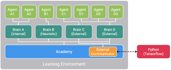

# Jump Training

## Team Unity: 
* Ko Kanghyuk, 2010009536, over2true@gmail.com 
* Kim Gihyun, 2014005341, progkim8@naver.com
* Ha Dongsu, 2014005687, gkehdtn4218@gmail.com

## Ⅰ. Introduction
* Motivation: We wanted to see how the machine learning works by using Unity Platform. By using the Unity, it is easy to see the progress while doing machine learning cause unity helps with visualizing the whole progress. Throughout this experience we can see the actual training process entirely.

* The main objective: To get **WallJump** model simulating.

## Ⅱ. Dataset
* 

## Ⅲ. Methodology
* The algorithm we're going to use mainly is DRL, Deep Reinforcement Learning. Deep reinforcement learning (DRL) uses deep learning and reinforcement learning principles in order to create efficient algorithms that can be applied on areas like robotics, video games, finance and healthcare.[1] Implementing deep learning architecture (deep neural networks or etc.) with reinforcement learning algorithms (Q-learning, actor critic or etc.), a powerful model (DRL) can be created that is capable to scale to previously unsolvable problems. You must decide policy so that you can define reward and negative function. DRL can dramatically improve the result by the appropriate setting, especially in Reward and Negative function part.

* Explaining features or code 

## Ⅳ. Evaluation & Analysis
* Unity Engine  
It is a tool for creating interactive content such as 3D video games, architectural visualizations, and simulations. Unity is a 3D engine used by many companies, professionals and practitioners. For this reason, the public resources and community are vast andeveryone can download and use freely available resources and various libraries and resources for development.
* ML-Agents(https://unity3d.com/how-to/unity-machine-learning-agents#how-it-works)  
This solution is called Unity Machine Learning Agents(ML-Agents) and is a beta version of the SDK.The ML-Agents SDK allows researchers and developers to transform games and simulations created using the Unity Editor into environments where intelligent agents can be trained using Deep Reinforcement Learning, Evolutionary Strategies, or other machine learning methods through a simple to use Python API.  

* The three main kinds of objects within any Learning Environment are: Agent, Brain, Academy

## Ⅴ. Related Work(e.g., existing studies)
* Hide / Escape - Avoidance of Pursuing Enemies.  
Training ML Agents to Avoid Traditional AI Using Curriculum-Based Reinforcement Learning.(https://connect.unity.com/p/hide-escape-avoidance-of-pursuing-enemies?_ga=2.134864823.771982053.1572239590-1717690672.1568966025)

* Vehicle Environment Static Obstacles with Unity ML-Agent.  
(https://connect.unity.com/p/vehicle-environment-static-environment?_ga=2.100325208.771982053.1572239590-1717690672.1568966025)

* This simulator is simple vehicle environment. In this environment, Agent should evade obstacle and get stars while keeps center of the lane.  
Pass the Butter / Pancake bot  
(https://connect.unity.com/p/pancake-bot?_ga=2.134864823.771982053.1572239590-1717690672.1568966025)

## Ⅵ. Conclusion
*

## About ML-Agents
**The Unity Machine Learning Agents Toolkit** (ML-Agents) is an open-source
Unity plugin that enables games and simulations to serve as environments for
training intelligent agents. Agents can be trained using reinforcement learning,
imitation learning, neuroevolution, or other machine learning methods through a
simple-to-use Python API. We also provide implementations (based on TensorFlow)
of state-of-the-art algorithms to enable game developers and hobbyists to easily
train intelligent agents for 2D, 3D and VR/AR games. These trained agents can be
used for multiple purposes, including controlling NPC behavior (in a variety of
settings such as multi-agent and adversarial), automated testing of game builds
and evaluating different game design decisions pre-release. The ML-Agents
toolkit is mutually beneficial for both game developers and AI researchers as it
provides a central platform where advances in AI can be evaluated on Unity’s
rich environments and then made accessible to the wider research and game
developer communities.

